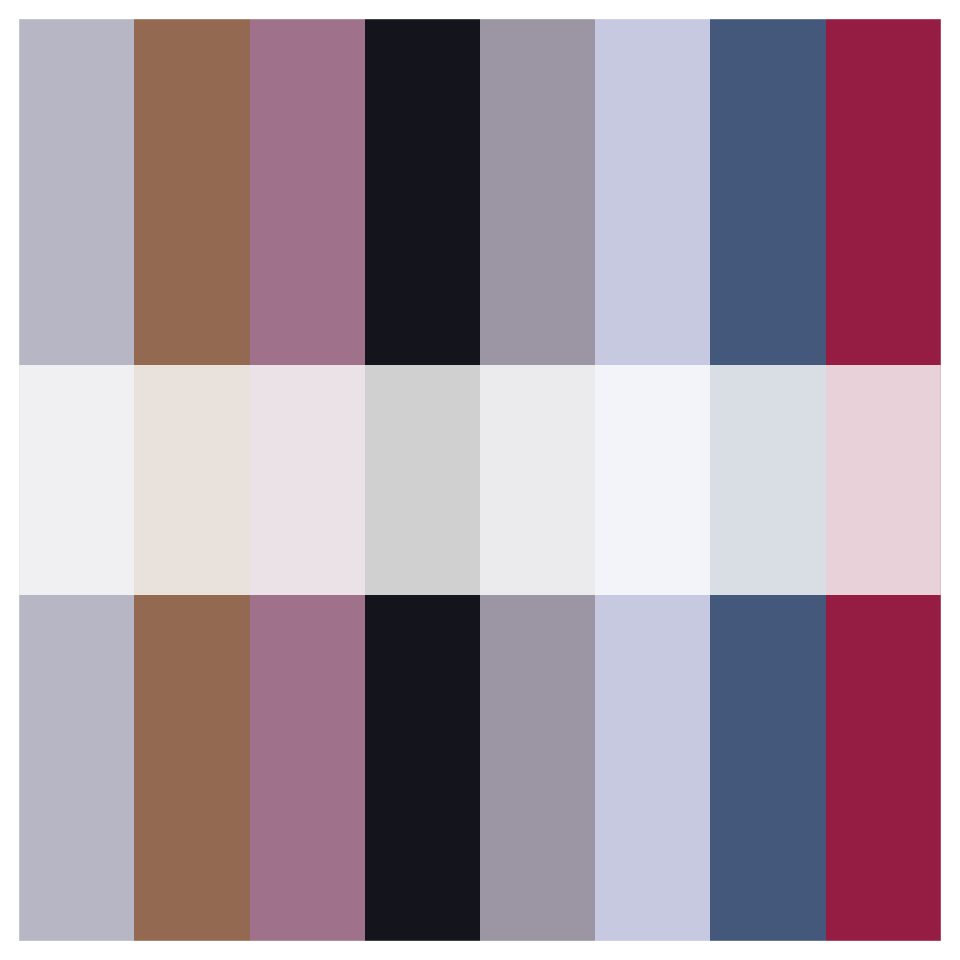
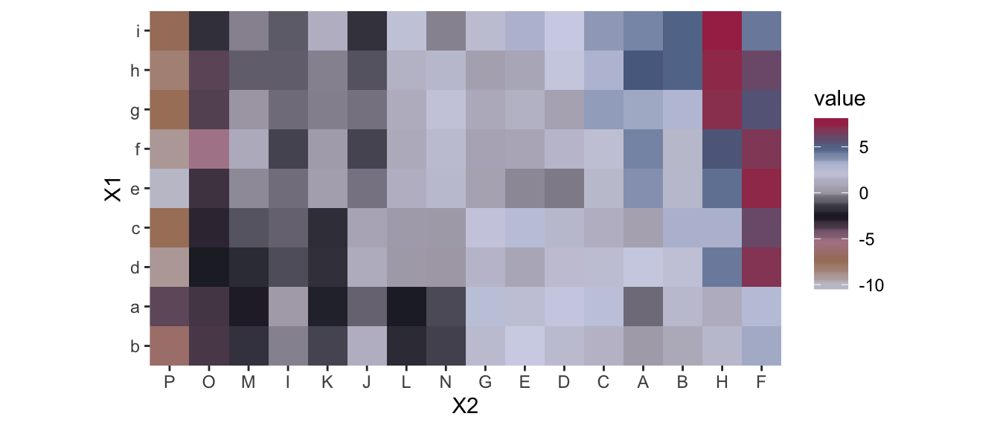

---
---

<!-- README.md is generated from README.Rmd. Please edit that file -->

# Covfefe Palettes

Thank you github.com/dill/beyonce for the framework of this palette generator. 
Thank you Beyoncé for your color inspo. 

Please Vote in November!.

## Installation

```R
devtools::install_github("rptashkin/covfefe")
```

## Usage

```{r, palettes_dummy}
library(covfefe)
```

```{r, covfefe_palette1, fig.width=5, fig.height=5}
print(covfefe_palette(1))
```




```{r, heatmap, fig.height = 3}
library(ggplot2)
pal <- covfefe_palette(1, 8, type = "continuous")
ggplot(heatmap, aes(x = X2, y = X1, fill = value)) +
   geom_tile() +
   scale_fill_gradientn(colours = pal) +
   scale_x_discrete(expand = c(0, 0)) +
   scale_y_discrete(expand = c(0, 0)) +
   coord_equal()
```


